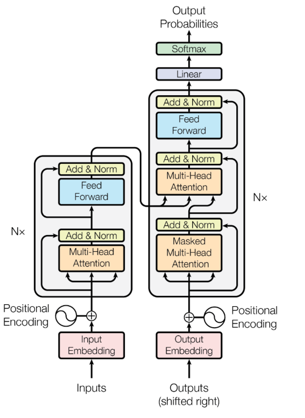
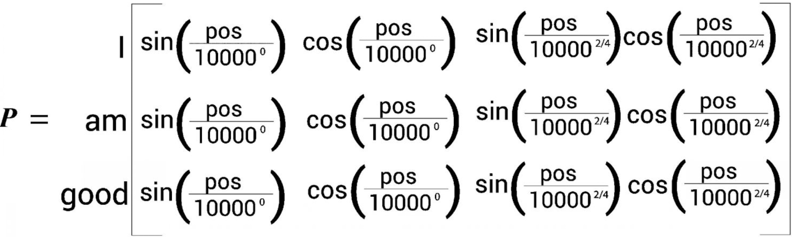
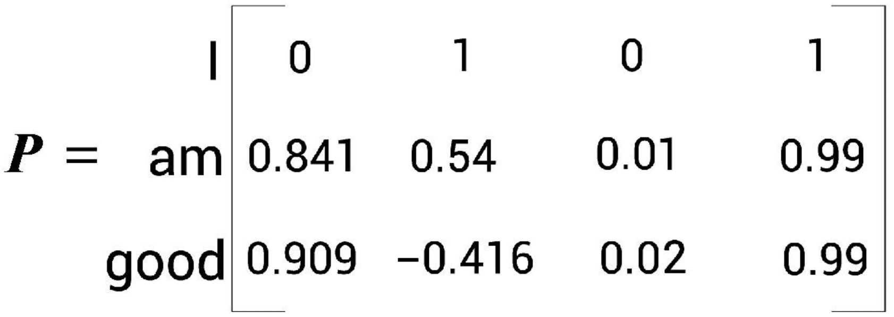
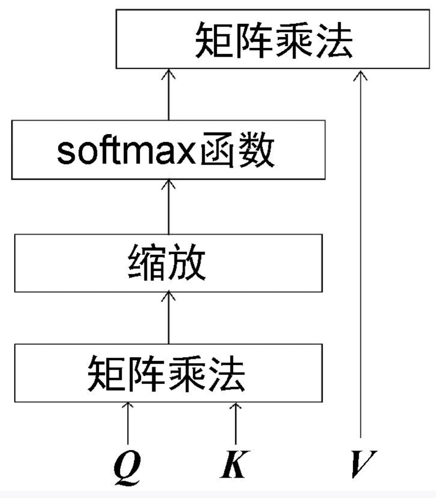

# Transformer 

在人工智能和自然语言处理领域,Transformer架构的出现无疑是一个里程碑式的突破。它不仅推动了GPT(Generative Pre-trained Transformer)等大型语言模型的发展,还彻底改变了我们处理和理解自然语言的方式。


## GPT与Transformer

### GPT

近几年，人工智能技术领域高潮迭出，给我们引爆了一轮又一轮技术热潮，人工智能界出现的“新顶流”——ChatGPT。ChatGPT是一个由OpenAI公司推出的大型语言模型(large language model, LLM)，它能帮助开发人员使用自然语言理解来增强聊天机器人和智能应用程序的功能，可以处理各种任务，如撰写文章、提供建议、回答问题等。

自2022年11月推出后，ChatGPT因其强大的功能爆红，用户数量暴增，仅2个月就达成了用户破亿的目标，成为史上用户最快破亿的应用。而达成这一目标，TikTok用了9个月，这足以说明ChatGPT的受欢迎程度了。

美国在线教育供应商Study.com的一项针对1000名美国学生的调查显示，超过89%的学生使用ChatGPT完成家庭作业，48%的学生用ChatGPT完成小测验，53%的学生用ChatGPT写论文。“ChatGPT风”简直席卷了大、中、小学，让学生党狂喜。但美国已经出台了相关政策，制止学生用人工智能完成作业，未来我们也需要正确引导孩子，让孩子以科学的方式接触这些先进的技术。


GPT

- G: Generative
- P: Pre-trained
- **T: Transformer**

GPT 是一种基于Transformer架构的大型语言模型。自2018年首次亮相以来,GPT系列模型在自然语言处理领域掀起了一场革命。它们展现出了前所未有的语言理解和生成能力,能够完成从文本续写到问答、翻译等各种复杂任务。


### Transformer: GPT的核心引擎

Transformer是GPT背后的核心架构,最初由Google团队在2017年的论文《Attention Is All You Need》中提出。

《Attention Is All You Need》不仅引入了 Transformer 模型，还证明了仅依靠注意力机制就能构建高效的序列转换模型。这篇论文的主要贡献包括：

- 提出了自注意力（Self-Attention）机制，使模型能够捕捉序列内部的长距离依赖关系。
- 引入了多头注意力（Multi-Head Attention），增强了模型的表达能力。
- 设计了位置编码（Positional Encoding），解决了序列顺序信息的问题。
- 证明了在没有循环或卷积的情况下，纯注意力模型可以达到最先进的性能。

Transformer 之所以叫做 "Transformer"，是因为它擅长于“变换”信息。这里的“变换”指的是模型能够捕捉和理解数据中的复杂关系。例如，在处理文本时，Transformer 可以识别出哪些词或短语之间有重要的联系，即使它们在句子中相隔很远。

它的核心技术是注意力机制，这使得模型可以“注意”到输入数据中最重要的部分。比如在阅读一句话时，模型会学会专注于那些关键词，就像我们在阅读时会特别关注某些重要的信息一样。与传统的循环神经网络(RNN)不同,Transformer完全基于注意力机制,摒弃了递归结构,这使得它能够更好地处理长距离依赖,并且支持并行计算,大大提高了训练效率。

所以，Transformer 的名字来源于它的这种能力，它能够根据数据的重要性变换自己的焦点，从而更好地理解和处理信息。


### Transformer 的工作原理简述

Transformer 模型的主要目标是根据给定的输入序列预测下一个可能的单词或标记。这个过程可以概括为以下步骤：

1. **输入处理**：将输入文本分割成标记（通常是单词或子词）。
2. **标记嵌入**：将每个标记转换为高维向量表示。
3. **位置编码**：为每个标记添加位置信息。
4. **注意力计算**：使用自注意力机制处理输入序列。
5. **前馈网络**：进一步处理注意力层的输出。
6. **输出层**：生成下一个标记的概率分布。



例如，给定输入序列 "The cat sat on the"，模型会尝试预测下一个最可能的单词，如 "mat"。

这个过程看似简单,但其中蕴含了复杂的数学原理和巧妙的设计思想。接下来,我们将深入探讨Transformer的核心组件,特别是注意力机制,以及它如何实现对语言的深度理解。


在深入探讨Transformer的内部结构之前,我们需要了解模型是如何处理和标准化输入数据的。

## Embedding

在深入了解 Transformer 的工作原理之前，我们需要先理解 embedding 这个关键概念。

### 什么是 Embedding ？

神经网络，基本上基于数字的，因此，如果要用它来处理像文本这样的东西，我们需要一种用数表示文本的方法使得计算机能够以数学的方式处理语言。

我们可以从为字典中的每个词分配一个数开始，例如分配给 cat 的可能是3542。

Embedding,中文常译为"嵌入"或"向量表示",是一种将离散的对象(如单词)映射到连续向量空间的技术。简单来说,就是将人类可以理解的信息转换为计算机可以处理的数值形式。

举个例子,假设我们有一个词汇表:{"猫", "狗", "鱼"}。我们可以用一个3维的向量来表示每个词:

- 猫 -> [1, 0, 0] 
- 狗 -> [0, 1, 0] 
- 鱼 -> [0, 0, 1]

这就是一种最简单的Embedding方式， 被称为One-hot编码。但在实际应用中,我们通常会使用更高维度、更密集的向量来表示词语,以捕捉更丰富的语义信息。

例如,我们可以将"猫"这个词表示为一个300维的向量:

[0.2, -0.4, 0.7, ..., 0.1]

这个向量的每一个维度都可能代表某种语义特征，虽然我们可能无法准确解释每个维度的具体含义，但整体上这个向量能够捕捉到"猫"这个词的语义信息。

### Embedding 的特性

Embedding的一个重要特性是它能够在向量空间中反映词与词之间的语义关系。在高维空间中，语义相近的词往往会聚集在一起。这种分布使得模型能够理解词与词之间的关系。具有相似含义或经常在相似上下文中出现的词，在embedding空间中往往会彼此靠近。例如：

- "猫"和"狗"的词向量可能会很接近，因为它们都是常见的宠物。而"猫"和"汽车"的词向量则可能相距较远。
- "国王"和"王后"的词向量之间的关系可能类似于"男人"和"女人"之间的关系。
- "Apple"这个词的向量可能会在"水果"和"科技公司"的向量之间，因为它有多重含义。

这种语义关系的表示使得模型能够更好地理解和处理自然语言。

### Tokenization

在进行embedding之前，我们需要先将文本分割成更小的单位，这个过程称为 tokenization，中文即词元化。根据不同的策略，我们可以将文本分割成单词、子词或者字符级别的 token。

对于同一句子"I love machine learning"，tokenization 的不同方式：

- character-level tokenization
  - ["I", " ", "l", "o", "v", "e", " ", "m", "a", "c", "h", "i", "n", "e", " ", "l", "e", "a", "r", "n", "i", "n", "g"]

- word-level tokenization
  - ["I", "love", "machine", "learning"]
- subword-level tokenization
  - ["I", "love", "machine", "learn", "ing"]

我们先讨论两种极端情况：word-level tokenization 和 character-level tokenization

#### character-level tokenization

最简单的词元化方案是按每个字符单独馈送到模型中。我们的模型希望把每个字符转换为一个整数，有时这个过程被称为数值化(numericalization)。一个简单的方法是用一个唯一的整数来编码每个唯一的 token（在这里为字符）。

最终得到了一个包括了每个字符到一个唯一性整数的映射，即词元分析器的词表。

但 character-level tokenization 存在明显的劣势：

- 序列长度增加：  character-level tokenization  会显著增加输入序列的长度。例如，"machine learning" 这个词组用单词级分词只有 2 个token，但用字符级分词则有16 个 token（包括空格）。这会导致以下问题：
  - 计算复杂度增加：在使用 Transformer 的模型中，计算复杂度与序列长度的平方成正比。 
  - 内存使用增加：更长的序列需要更多的内存来存储中间状态。 
- 语义信息稀疏： 字符级别的词元化忽略了文本中的任何结构，将整个字符串视为一串字符流。虽然这有助于处理拼写错误和生僻词，但主要缺点是语言结构（如单词）需要从数据中学习。这需要大量的计算、内存和数据。单个字符通常不携带明确的语义信息。模型需要通过组合多个字符才能获得有意义的语义单元，这增加了学习的难度。

#### word-level tokenization

与character-level tokenization相比，word-level tokenization将文本细分为单词，并将每个单词映射到一个整数。word-level tokenization使模型跳过从字符学习单词的步骤，从而降低训练过程的复杂性。有一种简单的单词词元化方法是使用空格来分割文本。

每个 token 都被视为独立的实体，可以单独处理。word-level tokenization 有一个缺点：鉴于单词可以包括变形、派生或拼写错误（例如great、greater和greatest），词表的大小很容易增长到数百万。

因此 character-level tokenization 也存在明显的劣势：

- Out-of-Vocabulary (OOV) 问题： 这是词级分词最显著的劣势。当遇到训练集中未出现过的词时，模型无法处理。这导致以下问题： 
  - 词汇表膨胀：为了减少OOV，需要增大词汇表，它导致了神经网络需要大量的参数，这增加了模型的复杂度和内存需求。 
  - 未知词处理：常用的解决方案如使用特殊的标记来表示未知词，但这会丢失信息。 
  - 领域适应性差：在新领域应用时，可能遇到大量未知词。

#### subword-level tokenization

在实际应用中,特别是在Transformer模型中,subword-level tokenization因其在词汇表大小和表达能力之间取得的良好平衡而被广泛使用。例如,BERT使用WordPiece,GPT系列使用BPE的变体。

subword-level tokenization 背后的基本思想是将字符和单词词元化的优点结合起来。一方面，我们希望将生僻单词拆分成更小的单元，以使模型能够处理复杂单词和拼写错误。另一方面，我们希望将常见单词作为唯一实体保留下来，以便我们将输入长度保持在可管理的范围内。subword-level tokenization是使用统计规则和算法从预训练语料库中学习的。

### Token Embedding

Token Embedding本质上是一个查找表操作。我们为词汇表中的每个token分配一个唯一的ID,然后用这个ID去查找对应的向量。

例如,假设我们有一个包含10000个token的词汇表,我们想要将每个token表示为一个300维的向量。那么Token Embedding层就可以看作是一个10000 x 300的矩阵,其中每一行对应一个token的向量表示。

Token Embedding通常是作为神经网络的一部分进行学习的。在训练过程中,模型会根据任务目标不断调整每个token的向量表示,使得语义相近的token在向量空间中的距离较近。

值得注意的是,很多预训练语言模型(如BERT、GPT)都提供了预训练好的Token Embedding。这些Embedding已经在大规模语料上学习到了丰富的语义信息,可以直接用于下游任务或进行微调。

### Positional Coding

在Transformer模型中,除了Token Embedding,还有一个重要的组件是 positional coding 。它的作用是为模型提供token在序列中的位置信息。

Transformer模型抛弃了传统的循环或卷积结构,采用了纯注意力机制。这带来了并行计算的优势,但也导致模型失去了序列的顺序信息。例如,"我爱你"和"你爱我"包含相同的token,但意思完全不同。

不过，并行地将词送入Transformer，却不保留词序，它将如何理解句子的意思呢？要理解一个句子，词序（词在句子中的位置）很重要吗，因此需要额外的机制来告诉模型每个token的位置。

因此,我们需要额外的机制来告诉模型每个token的位置。

 positional coding ， 顾名思义，位置编码是指词在句子中的位置（词序）的编码。

位置编码矩阵究竟是如何计算的呢？如下所示，Transformer论文“Attention Is All You Need”的作者使用了正弦函数来计算位置编码:

```
P(pos, 2i) = sin(pos / 10000^(2i/d_model))
P(pos, 2i+1) = cos(pos / 10000^(2i/d_model))
```

在上面的等式中，pos表示该词在句子中的位置，i 表示在输入矩阵中的位置。

下面通过一个例子来理解以上等式.






这种编码方式的优点：

- 它可以处理任意长度的序列,因为编码可以延续到任何位置。
- 它允许模型轻松学习到相对位置, 因为对于任何固定的偏移k, P(pos+k)可以表示为P(pos)的线性函数。


### Input Embedding

在Transformer中，input embedding通常是token embedding和positional coding的和。这意味着每个输入token的最终表示不仅包含了它的语义信息，还包含了它在序列中的位置信息。

```
Input Embedding = Token Embedding + Positional Coding
```


## Normalization

### Normalization

normalization 是将输入数据调整到一个标准范围内的过程,通常是将较大的值调整为接近1,较小的值调整为接近0。这个过程有几个重要作用:

1. 加速收敛:使梯度下降过程更加稳定,加快模型的学习速度。
2. 提高模型稳定性:归一化可以减少数据中的极端值对模型的影响,使模型更加稳定。
3. 改善模型泛化能力:归一化可以降低模型对特定数据分布的依赖,提高模型在不同数据集上的泛化能力。


### Softmax

在Transformer中,一个常用的归一化技术是Softmax函数。它的作用是将一组数值转换为概率分布,使得所有值的和为1。

Softmax的计算过程如下:

T=0

1. 对每个输入值取指数(e^x)
2. 计算所有指数值的和
3. 将每个指数值除以和

数学表达式为:softmax(x_i) = e^x_i / Σ(e^x_j)

例如,对于输入[2, 1, 0.1]:

1. 取指数:[7.39, 2.72, 1.11]
2. 求和:11.22
3. 除以和:[0.66, 0.24, 0.10]

结果是一个概率分布,表示模型对各个选项的"confidence"。


### Layer Normalization

Layer Normalization是Transformer中另一个重要的归一化技术。它的作用是标准化每一层的输出,使得输出的均值为0,方差为1。

Layer Normalization的计算步骤:

1. 计算均值(mean) ： (1/H) * Σ(x_i)
2. 计算方差(variance) ： (1/H) * Σ((x_i - μ)^2)
3. 归一化 ：(x - mean) / sqrt(variance + ε)
4. 缩放和平移  γ * y_i + β

这个过程确保了每一层的输出都在一个合理的范围内,有利于后续层的处理。

计算示例：

假设我们有一个隐藏层,其输入x是一个4维向量: x = [1, 2, 3, 4]

1. 计算均值 
   - μ = (1 + 2 + 3 + 4) / 4 = 2.5

2. 计算方差
   - σ^2 = ((1-2.5)^2 + (2-2.5)^2 + (3-2.5)^2 + (4-2.5)^2) / 4
         = ((-1.5)^2 + (-0.5)^2 + 0.5^2 + 1.5^2) / 4
         = (2.25 + 0.25 + 0.25 + 2.25) / 4
         = 1.25

3. 归一化
   - 假设ε = 1e-5
   - y_1 = (1 - 2.5) / sqrt(1.25 + 1e-5) ≈ -1.34
     y_2 = (2 - 2.5) / sqrt(1.25 + 1e-5) ≈ -0.45
     y_3 = (3 - 2.5) / sqrt(1.25 + 1e-5) ≈ 0.45
     y_4 = (4 - 2.5) / sqrt(1.25 + 1e-5) ≈ 1.34

4. 缩放和平移
   - 假设γ = 1.5和β = 0.5(这些是可学习的参数,这里我们假设它们已经学习到这些值)
   - z_1 = 1.5 * (-1.34) + 0.5 ≈ -1.51
     z_2 = 1.5 * (-0.45) + 0.5 ≈ -0.18
     z_3 = 1.5 * 0.45 + 0.5 ≈ 1.18
     z_4 = 1.5 * 1.34 + 0.5 ≈ 2.51
5. 因此,经过Layer Normalization后,输入x = [1, 2, 3, 4]被转换为z ≈ [-1.51, -0.18, 1.18, 2.51]。


## Attention

在过去几年中,Transformer模型在自然语言处理(NLP)领域取得了巨大的成功,成为了许多先进语言模型的基础架构。而Attention机制是Transformer的核心组成部分,也是其成功的关键所在。

在我们深入探讨Transformer中的Attention之前,让我们先来理解一下什么是Attention。

### Attention的直观理解

Attention可以被理解为"注意力"。在日常生活中,当我们阅读一篇文章或听一段演讲时,我们的大脑会自动关注重要的信息,而忽略不太相关的部分。这种选择性注意的能力就是Attention的本质。

在机器学习中,Attention机制模仿了人类的这种能力,使模型能够在处理输入信息时,有选择性地关注最相关和最重要的部分。

### Attention In NLP

在自然语言处理任务中,Attention机制允许模型在生成输出时,动态地关注输入序列的不同部分。例如,在机器翻译任务中,当模型翻译一个词时,它会"关注"源语言句子中最相关的词或短语,而不是机械地逐词翻译。

当你看到单词“flies”时会想到什么。也许你会想到令人讨厌的昆虫，但是如果你得到更多的上下文，比如“time flies like an arrow”，那么你会意识到“flies”表示的是动词。同样地，我们可以通过以不同的比例结合所有词元嵌入来创建“flies”的表示形式，也许可以给“time”和“arrow”的词元嵌入分配较大的权重w_ji。用这种方式生成的嵌入称为上下文嵌入，早在Transformer发明之前就存在了，例如ELMo语言模型。

### Selft Attention

现在,让我们聚焦到Transformer模型中的Attention机制。Transformer使用了一种特殊的Attention,称为"自注意力"(Self-Attention)。

#### Self-Attention的基本思想

Self-Attention的核心思想是:对于序列中的每个元素,都要计算它与序列中所有其他元素(包括它自己)的关联程度。这种关联程度决定了在生成该元素的表示时,应该多大程度地考虑其他元素的信息。

#### Self-Attention的计算过程

Self-Attention的计算过程可以分为以下几个步骤:

1. 将每个词元嵌入投影到三个向量中，分别称为query、key和value。
2. 计算注意力分数。我们使用相似度函数确定query和key向量的相关程度。顾名思义，缩放点积注意力的相似度函数是点积，并通过嵌入的矩阵乘法高效计算。相似的query和key将具有较大的点积，而那些没有相似处的则几乎没有重叠。这一步的输出称为注意力分数，在一个有n个输入词元的序列中，将对应着一个n×n的注意力分数矩阵。
3. 计算注意力权重。点积在一般情况下有可能会产生任意大的数，这可能会导致训练过程不稳定。为了处理这个问题，首先将注意力分数乘以一个缩放因子来规范化它们的方差，然后再通过softmax进行规范化，以确保所有列的值相加之和为1。结果得到一个n×n的矩阵，该矩阵包含了所有的注意力权重wji。
4. 更新词嵌入。计算完注意力权重之后，我们将它们与值向量v1，…，vn相乘，最终获得词嵌入表示R。

这个过程可以用公式来表示:

```
Attention(Q, K, V) = softmax(QK^T / sqrt(d_k))V
```

其中,d_k是Key向量的维度。



可视化权重计算的库：https://github.com/jessevig/bertviz?tab=readme-ov-file

体验地址：https://colab.research.google.com/drive/1hXIQ77A4TYS4y3UthWF-Ci7V7vVUoxmQ?usp=sharing#scrollTo=twSVFOM9SopW

在你第一次接触query、key和value向量的概念时，可能会觉得这些概念有点晦涩难懂。这些概念受到信息检索系统的启发，但我们可以用一个简单的类比来解释它们的含义。你可以这样想象，你正在超市购买晚餐所需的所有食材。你有一份食谱，食谱里面每个食材可以视为一个query。然后你会扫描货架，通过货架上的标注(key)，以检查该商品是否与你列表中的食材相匹配（相似度函数）。如果匹配成功，那么你就从货架上取走这个商品(value)。

在这个类比中，你只会得到与食材匹配的商品，而忽略掉其他不匹配的商品。自注意力是这个类比更抽象和流畅的版本：超市中的每个标注都与配料匹配，匹配的程度取决于每个key与query的匹配程度。因此，如果你的清单包括一打鸡蛋，那么你可能会拿走10个鸡蛋、一个煎蛋卷和一个鸡翅


### Multi-Head Attention

Transformer中使用的是Multi-Head Attention,它是 Self-Attention 的一个扩展。Multi-Head Attention并行地执行多个Self-Attention操作,每个操作称为一个"头"(head)。

Transformer 模型中的 Multi-Head Attention 是其核心创新之一。它允许模型同时从不同的表示子空间关注输入的不同部分。每个"头"都独立地学习不同的注意力模式，然后将这些模式组合起来，形成一个更丰富的表示。每个头都有自己的一组Query、Key和Value权重矩阵,这允许模型从不同的表示子空间学习信息。最后,将所有头的输出连接起来,并通过一个线性变换,得到最终的Multi-Head Attention输出。

让我们通过一个具体的例子来理解 Transformer 如何利用上下文进行预测。假设我们有以下小说片段：

"The detective entered the dark room. He fumbled for the light switch, but suddenly heard a ___"

在这个例子中，Transformer 模型会考虑整个上下文来预测下一个词。它会特别关注关键词如 "detective"、"dark room"、"light switch" 等，这些词提供了重要的上下文信息。模型可能会预测如 "noise"、"sound" 或 "voice" 这样的词，因为这些词在给定的情境下是合理的。

在预测过程中，Transformer 不断更新其内部表示。每个注意力块都会产生新的向量表示，这些表示逐步融合了更多的上下文信息。例如：

1. 初始向量可能只包含 "detective" 这个词的基本含义。
2. 经过第一个注意力块后，向量可能融入了 "dark room" 的信息。
3. 再经过一个注意力块，向量可能进一步包含了 "light switch" 的上下文。

这个过程使得最终的向量表示能够更全面地捕捉整个句子的语境，从而做出更准确的预测。

多头注意力的计算过程:

1. 将输入向量线性投影h次(h为头数),得到h组Q、K、V。
2. 对每组Q、K、V执行自注意力计算。
3. 将h个注意力的输出拼接。
4. 再经过一次线性变换,得到最终输出。

数学表达式

```
MultiHead(Q, K, V) = Concat(head_1, ..., head_h)W^O
where head_i = Attention(QW_i^Q, KW_i^K, VW_i^V)
```


### Attention机制的直观理解

为了更好地理解Attention机制,让我们用一个简单的例子来说明。

想象你正在翻译这句英语:"The cat sat on the mat."

当你翻译"cat"这个词时,你会特别关注英语句子中的"cat"。当你翻译"sat"时,你会同时关注"cat"和"sat",因为你需要知道是谁在坐。当你翻译"mat"时,你会关注"sat"和"mat",因为你需要知道猫坐在哪里。

这就是Attention的工作方式。对于输出的每个词,模型都会"关注"输入句子中最相关的部分。Attention权重决定了每个输入词对当前输出词的重要程度。


### Attention机制的数学原理

现在,让我们更深入地了解Attention机制的数学原理。

#### 向量表示

在NLP任务中,我们通常使用向量来表示词或其他语言单元。

例如,一个词可能被表示为一个300维的向量。

这种表示方法称为词嵌入(word embedding)。

#### Query, Key, Value

在Self-Attention中,我们为每个输入元素生成三个向量:Query(Q), Key(K), 和Value(V)。这些向量是通过将输入向量与三个不同的权重矩阵相乘得到的:

Q = X * W_Q
K = X * W_K
V = X * W_V

其中,X是输入向量,W_Q, W_K, W_V是可学习的权重矩阵。

#### 注意力分数

对于序列中的每个位置i,我们计算它的Query向量与所有位置的Key向量的点积,得到注意力分数:

score_ij = Q_i · K_j^T

这个分数表示位置i对位置j的注意力程度。

为何需要计算查询矩阵与键矩阵的点积呢？通过计算两个向量的点积可以知道它们之间的相似度。通过计算查询向量和键向量的点积，可以了解 token 与句子中的所有 token 的相似度。。

#### 缩放和Softmax

为了使梯度更稳定,我们通常会对注意力分数进行缩放,除以Key向量维度的平方根。然后,我们使用Softmax函数将这些分数转换为概率分布:

attention_weights = softmax(scores / √d_k)

其中,d_k是Key向量的维度。

#### 加权求和

最后,我们使用这些注意力权重对Value向量进行加权求和:

output = Σ(attention_weights * V)

这就是Self-Attention的输出。


### Transformer中的Attention变体

Transformer中使用了几种不同的Attention变体,让我们来了解一下它们的区别。

#### Encoder Self-Attention

在Transformer的编码器中,使用的是标准的Self-Attention。每个位置都可以关注序列中的所有位置。

#### Decoder Self-Attention

在解码器中,使用的是掩蔽的Self-Attention(Masked Self-Attention)。在生成过程中,每个位置只能关注它之前的位置,以防止信息泄露。

#### Encoder-Decoder Attention

在编码器-解码器注意力层中,Query来自前一个解码器层,而Key和Value来自编码器的输出。这允许解码器关注输入序列的相关部分。

### Attention机制的实现

让我们用Python代码简单实现一下Self-Attention机制,以加深理解:

```python
import numpy as np

def softmax(x):
    exp_x = np.exp(x - np.max(x, axis=-1, keepdims=True))
    return exp_x / np.sum(exp_x, axis=-1, keepdims=True)

def self_attention(Q, K, V):
    # 计算注意力分数
    scores = np.matmul(Q, K.transpose(-1, -2))
    
    # 缩放
    d_k = K.shape[-1]
    scaled_scores = scores / np.sqrt(d_k)
    
    # 应用softmax得到注意力权重
    attention_weights = softmax(scaled_scores)
    
    # 加权求和
    output = np.matmul(attention_weights, V)
    
    return output, attention_weights

# 示例使用
seq_length = 4
d_model = 8

# 随机初始化Q, K, V
Q = np.random.randn(seq_length, d_model)
K = np.random.randn(seq_length, d_model)
V = np.random.randn(seq_length, d_model)

output, weights = self_attention(Q, K, V)

print("Attention输出形状:", output.shape)
print("注意力权重形状:", weights.shape)
```

这个简单的实现展示了Self-Attention的基本计算过程。在实际的Transformer模型中,还会有更多的细节,如多头注意力、残差连接等。


## Feed-Forward Network

Feed-Forward Network,顾名思义,是一种前馈神经网络。在Transformer中,FFN通常是一个简单的两层全连接神经网络。

FFN的基本结构如下:

Input -> Linear Layer -> ReLU Activation -> Linear Layer -> Output

其中:

- Input: 输入向量
- Linear Layer: 线性变换层
- ReLU Activation: 激活函数
- Output: 输出向量


#### FFN的工作原理

为了更好地理解FFN的工作原理,我们将逐步分解其内部结构和计算过程。

##### 输入和输出

FFN的输入和输出都是向量。在Transformer中,这些向量通常代表序列中的单个位置(如一个单词或一个图像patch)。

假设输入向量的维度为d_model(在原始Transformer论文中为512),FFN的输出向量维度也保持为d_model。

##### 第一个线性层

FFN的第一个线性层将输入向量从d_model维扩展到一个更高的维度d_ff(在原始论文中为2048)。这个扩展过程可以表示为:

y1 = W1 * x + b1

其中:

- x 是输入向量 (维度: d_model)
- W1 是权重矩阵 (维度: d_ff x d_model)
- b1 是偏置向量 (维度: d_ff)
- y1 是第一层的输出 (维度: d_ff)

##### 激活函数

在第一个线性层之后,FFN使用ReLU(Rectified Linear Unit)作为激活函数。ReLU的定义很简单:

ReLU(x) = max(0, x)

也就是说,ReLU将所有负值置为0,而保持正值不变。这个非线性变换为网络引入了非线性能力,使其能够学习更复杂的函数。

##### 第二个线性层

第二个线性层将向量从高维度(d_ff)压缩回原始维度(d_model):

y2 = W2 * ReLU(y1) + b2

其中:

- W2 是权重矩阵 (维度: d_model x d_ff)
- b2 是偏置向量 (维度: d_model)
- y2 是最终输出 (维度: d_model)

##### 完整的FFN前向传播过程

综上所述,FFN的完整前向传播过程可以表示为:

FFN(x) = W2 * ReLU(W1 * x + b1) + b2

这个看似简单的公式,实际上赋予了Transformer强大的建模能力。

### FFN的作用和重要性

现在我们已经了解了FFN的基本结构和工作原理,接下来让我们探讨它在Transformer中的作用和重要性。

- 引入非线性：FFN的主要作用是在Transformer中引入非线性变换。自注意力机制本质上是线性的,而FFN通过ReLU激活函数引入了非线性,使得整个网络能够学习更复杂的函数映射。

- 增加模型容量：FFN将输入向量先扩展到更高的维度(d_ff),然后再压缩回原始维度。这个过程显著增加了模型的参数数量和表达能力。在原始Transformer中,d_ff是d_model的4倍,这意味着FFN贡献了模型中的大部分参数。

- 位置特定的特征提取：与自注意力层不同,FFN独立地处理每个位置的信息。这使得FFN能够学习位置特定的特征,补充了自注意力层的全局建模能力。

- 信息整合：FFN可以被视为一种信息整合机制。它接收自注意力层的输出,进行进一步的特征提取和变换,然后产生更丰富、更有信息量的表示。


带着图，梳理一下 Transformer 整体的流程


## Coder

1. 将输入转换为嵌入矩阵（输入矩阵），并将位置编码加入其中，再将结果作为输入传入底层的编码器（编码器1）。
2. 编码器1接受输入并将其送入多头注意力层，该子层运算后输出注意力矩阵M。
3. 将注意力矩阵M输入到下一个子层，即前馈网络层。前馈网络层将注意力矩阵作为输入，并计算出特征值作为输出。
4. 接下来，把从编码器1中得到的输出作为输入，传入下一个编码器（编码器2）。
5. 编码器2进行同样的处理，再将给定输入句子的特征值作为输出。

这样可以将N个编码器一个接一个地叠加起来。从最后一个编码器（顶层的编码器）得到的输出将是给定输入句子的特征值。让我们把从最后一个编码器（在本例中是编码器2）得到的特征值表示为R。

我们把R作为输入传给解码器。解码器将基于这个输入生成目标句。


## Decoder

1. 首先，我们将解码器的输入转换为嵌入矩阵，然后将位置编码加入其中，并将其作为输入送入底层的解码器（解码器1）。
2. 解码器收到输入，并将其发送给带掩码的多头注意力层，生成注意力矩阵M。
3. 然后，将注意力矩阵M和编码器输出的特征值R作为多头注意力层（编码器−解码器注意力层）的输入，并再次输出新的注意力矩阵。
4. 把从多头注意力层得到的注意力矩阵作为输入，送入前馈网络层。前馈网络层将注意力矩阵作为输入，并将解码后的特征作为输出。
5. 最后，我们把从解码器1得到的输出作为输入，将其送入解码器2。
6. 解码器2进行同样的处理，并输出目标句的特征。

我们可以将N个解码器层层堆叠起来。从最后的解码器得到的输出（解码后的特征）将是目标句的特征。接下来，我们将目标句的特征送入线性层和softmax层，通过概率得到预测的词。


# 总结

Transformer 的出现彻底改变了自然语言处理领域。通过本文，我们了解了 Transformer 的核心组件和工作原理：

1. **创新的架构设计**：
   - 抛弃了传统的循环/卷积结构，完全基于注意力机制
   - 采用编码器-解码器架构，能够有效处理序列转换任务
   - 通过并行计算显著提高了训练效率

2. **核心组件**：
   - Embedding 系统：包括 Token Embedding 和位置编码
   - 多头注意力机制：允许模型同时关注不同的表示子空间
   - 前馈神经网络：增加模型的非线性变换能力
   - Layer Normalization：确保训练的稳定性

3. **工作流程**：
   - 编码器将输入序列转换为抽象表示
   - 解码器利用这些表示生成输出序列
   - 整个过程是端到端的，无需人工特征工程

Transformer 的成功不仅体现在其强大的性能上，更重要的是它为后续的 GPT、BERT 等模型奠定了基础架构，开创了预训练语言模型的新纪元。正如其论文标题 "Attention Is All You Need" 所暗示的，注意力机制确实成为了现代深度学习中最重要的机制之一。

随着技术的不断发展，基于 Transformer 的模型仍在不断创新和进步，在各种任务上展现出越来越强大的能力。理解 Transformer 的工作原理，对于我们把握人工智能的发展方向具有重要意义。
